# Tarea 01.
Primero tenemos que abrir una consola donde tengamos nuestra clave privada y darle permisos:
````chmod 400 AWSAdrian.pem````

Despues nos conectaremos mediante SSH:
````ssh -i "AWSAdrian.pem" ubuntu@ec2-52-55-225-137.compute-1.amazonaws.com````

Una vez conectados instalaremos lo siguiente:
- [Apache](#apache)
- [MySQL](#mysql)
- [PHP](#php)

## Apache

Antes que nada haremos un update
````sudo apt-get update````
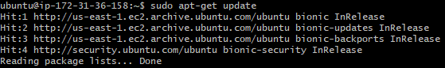

Y ahora instalaremos apache.
````sudo apt-get install apache2````
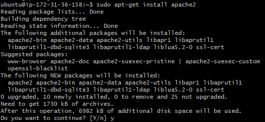

Ahora tendremos que ajustar el Firewall para permitir el trafico.
````sudo ufw allow in "Apache Full"````
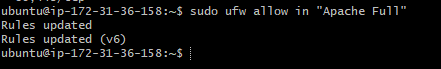

Si lo hemos hecho correctamente podremos entrar a la ip publica en nuestro navegador y veremos el index de apache.
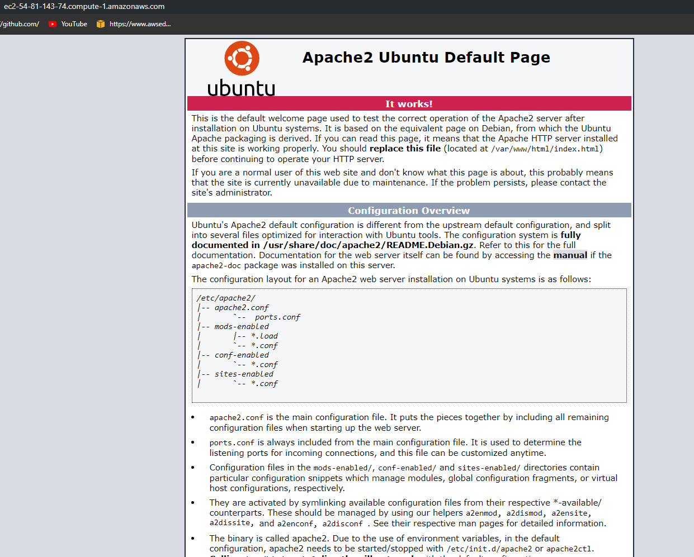

## MySQL

Instalaremos MySQL, para ello usaremos este comando:
````sudo apt install mysql-server````
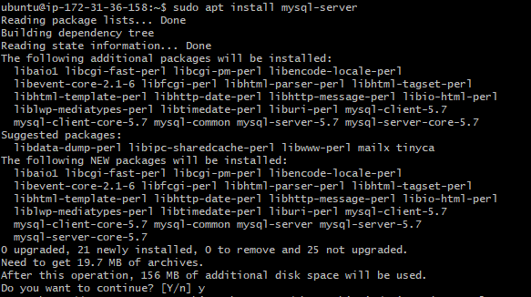

Ahora usaremos este comando para ejecutar un script de seguridad:
````sudo mysql_secure_installation````

Nos pedira algunas configuraciones y la contraseña de root:
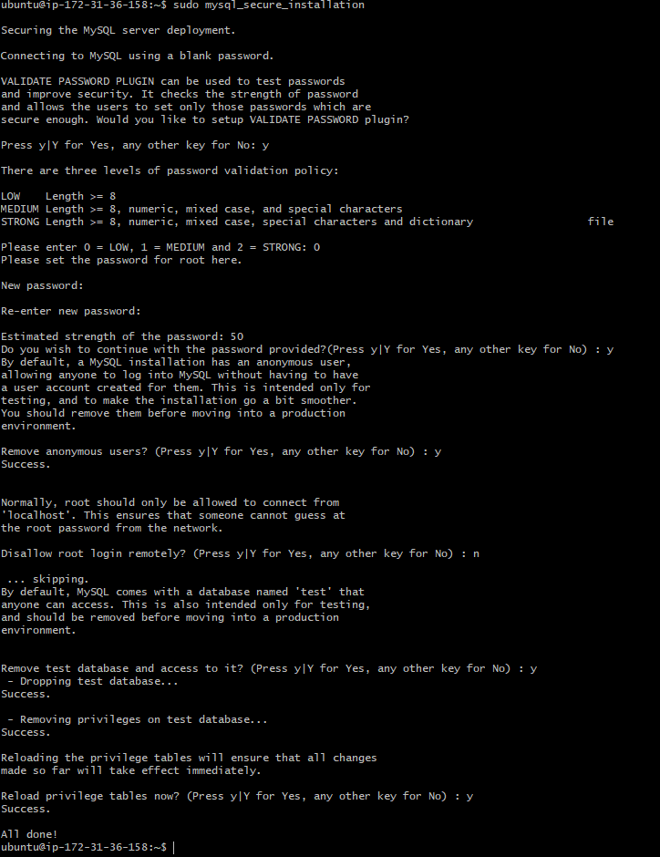

Una vez configurado podremos usar MySQL con el comando ***sudo mysql***.
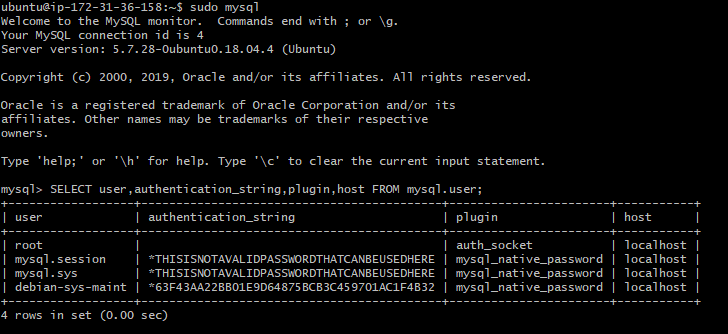

## PHP

Instalaremos PHP usando este comando:
````sudo apt install php libapache2-mod-php php-mysql````


Ahora tendremos que configurar apache para que index.php tenga preferencia.
Para eso editaremos el archivo ***dir.conf***:
````sudo nano /etc/apache2/mods-enabled/dir.conf````
Estara asi:
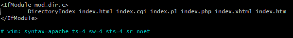
Lo dejamos asi:
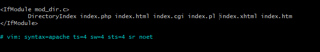

Reiniciamos apache:
````sudo systemctl restart apache2````

Ahora configuramos los virtual hosts:
Primero creamos una carpeta para nuestro dominio.
````sudo mkdir /var/www/adrian.fpz1920.com````

Ahora aplicamos permisos en la carpeta.
````sudo chown -R $USER:$USER /var/www/adrian.fpz1920.com````
````sudo chmod -R 755 /var/www/adrian.fpz1920.com````

Ahora creamos un index para nuestro dominio:
````nano /var/www/adrian.fpz1920.com/index.php````

Ahora creamos el archivo del virtual host:
````sudo nano /etc/apache2/sites-available/adrian.fpz1920.com.conf````

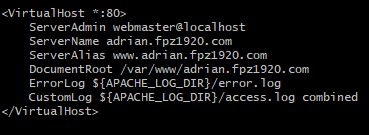

Vamos a activar el host:
````sudo a2ensite adrian.fpz1920.com.conf````

Y desactivamos el default:
````sudo a2dissite 000-default.conf````

Hacemos un test para comprobar errores:
````sudo apache2ctl configtest````

Si no hay ningun fallo reiniciamos apache:
````sudo systemctl restart apache2````

Ahora para comprobar que PHP esta funcionando correctamente crearemos un pequeño script.
````sudo nano /var/www/adrian.fpz1920.com/info.php````
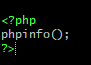

Ahora si entramos a ese archivo desde el dominio aparecera esto:
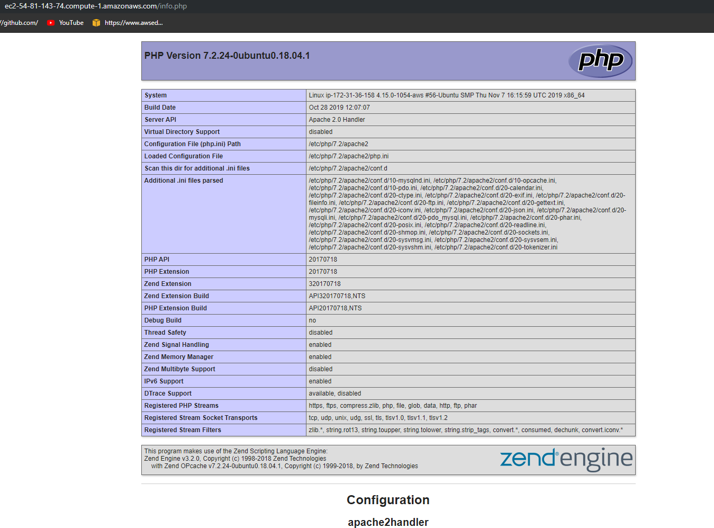

# Tarea 02.

Tendremos que utilizar una ip elastica, para ello entraremos aqui en el servidor:
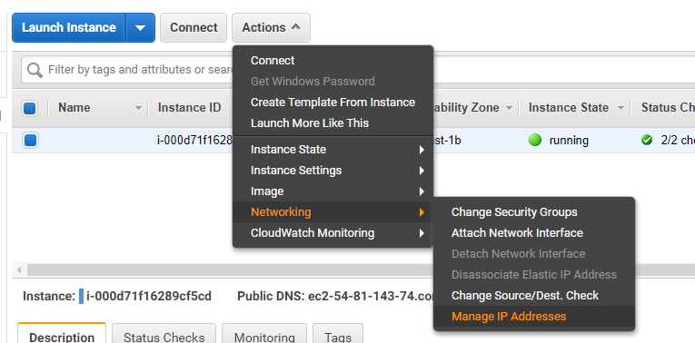
En la siguiente ventana le daremos a **Alocate an Elastic IP** :
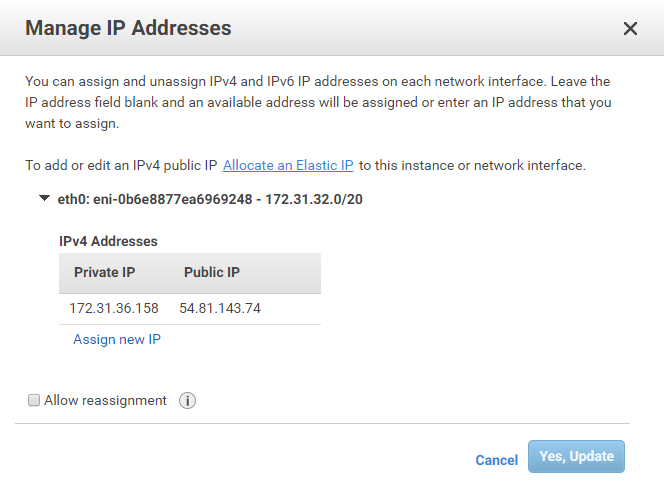
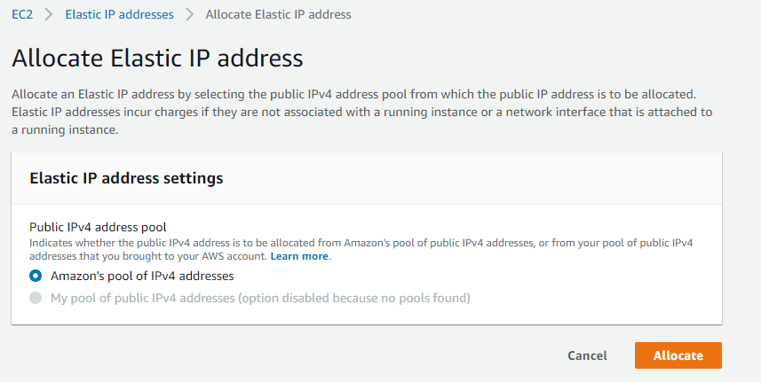
Ahora tendremos la ip elastica, pero no esta asociado a ningun servidor, para ello le daremos click a **Associate elastic ip address**:
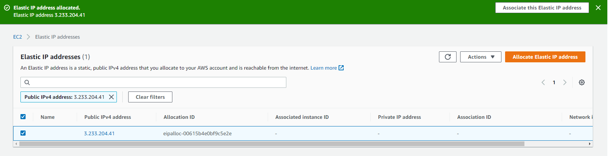
En esta ventana elegiremos nuestro servidor:
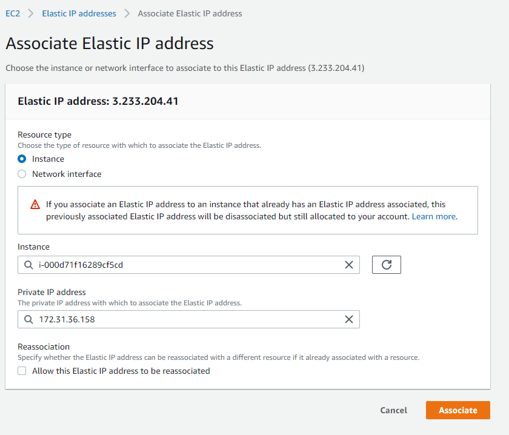
Ya tendremos la ip elastica asociada al servidor.

# Tarea 03 / 04.

Crearemos un registro DNS para nuestro servidor, para ello accederemos al panel del subdominio y entraremos en registro DNS.
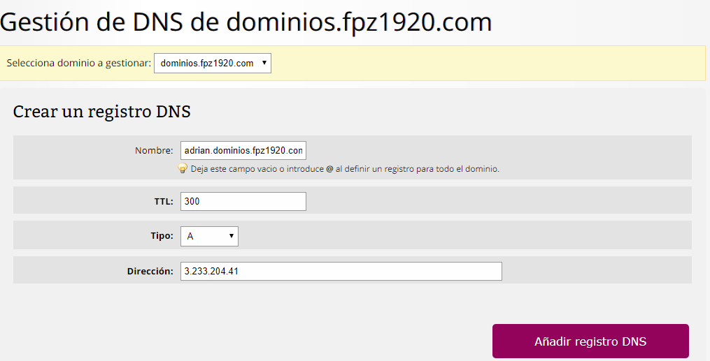

Ahora deberemos modificar el *Virtual Host*.
Primero haremos una copia de 000-default.conf y lo editaremos:
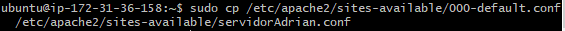
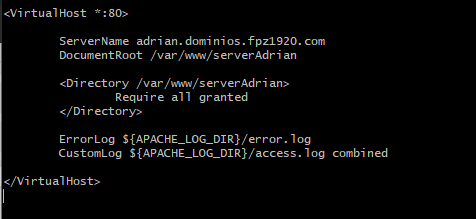
Activamos el virtual host y reiniciamos apache.

Entramos al dominio *(yo ya he subido un index)*.
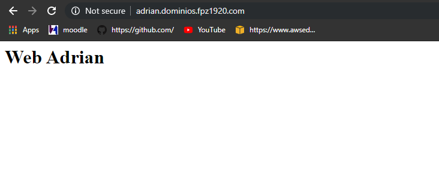

# Tarea 05.

Ahora debemos crear el servidor FTP para poder intercambiar archivos con el servidor.

Primero instalamos vsftpd
````sudp apt-get install vsftpd````

Una vez instalador tenemos que permitir el trafico FTP desde el firewall

para añadiremos una regla aqui

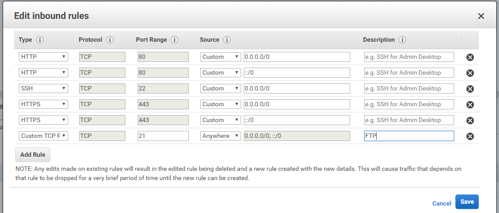

Ahora comprobamos que estan activos
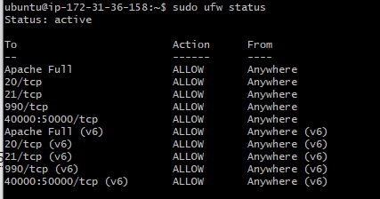

una vez activo crearemos los usuarios

````sudo useradd -g ftp -d /var/www/cliente/ -c "Usu Cliente" cliente````

````sudo useradd -g ftp -d /var/www/servidor/ -c "Usu Servidor" servidor````

````sudo useradd -g ftp -d /var/www/ -c "Usu admin" administrador````


Tambien deberemos asignar contraseñas a esos usuarios con ***sudo passwd "usuario"***

Ahora nos podremos conectar mediante WinSCP:
Cliente:
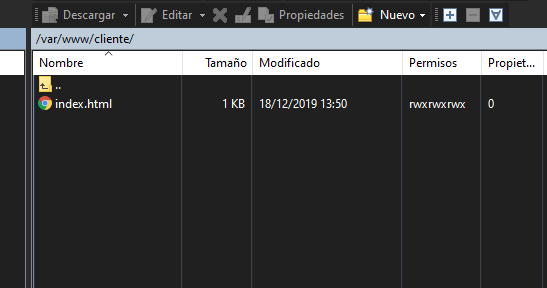
Servidor:
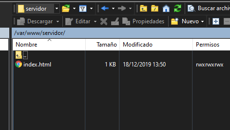
Admin:
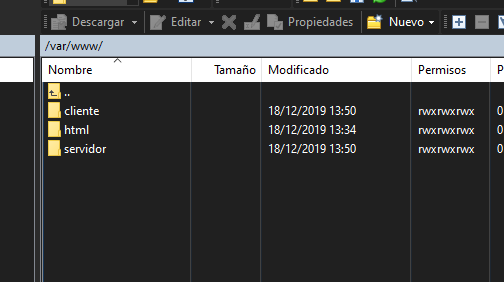
